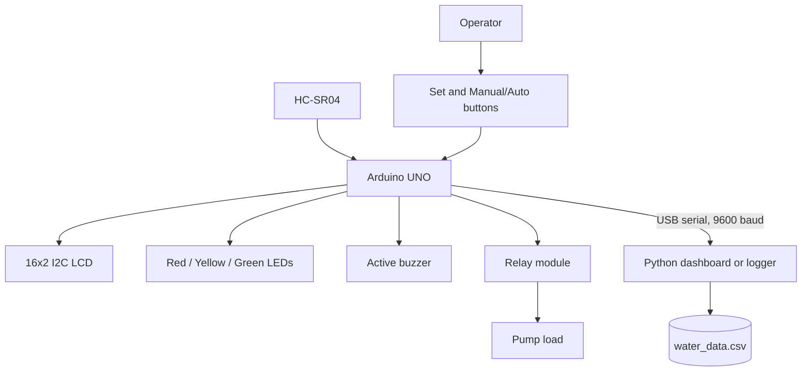
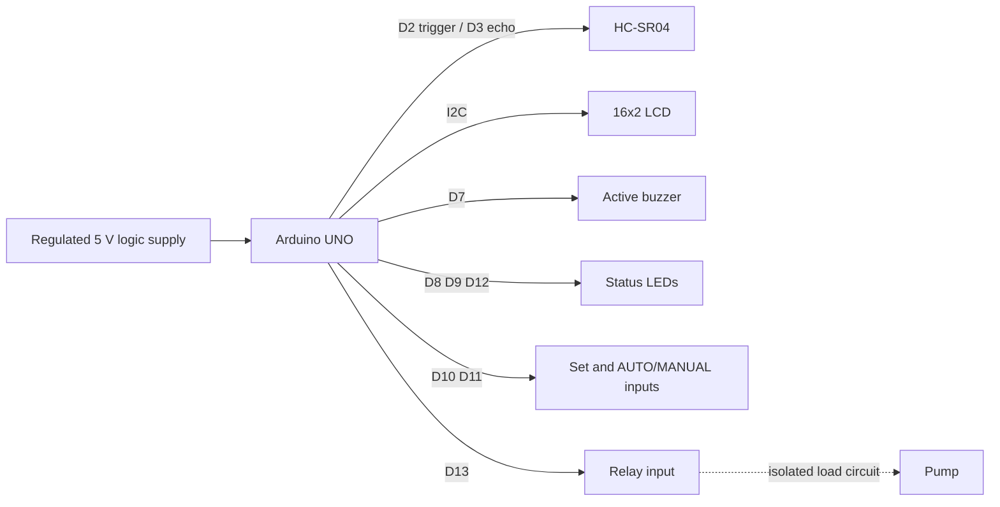
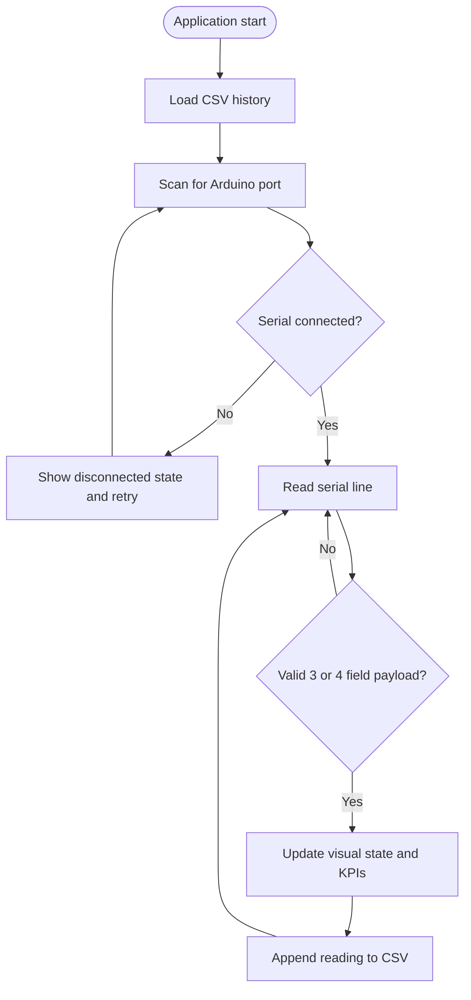
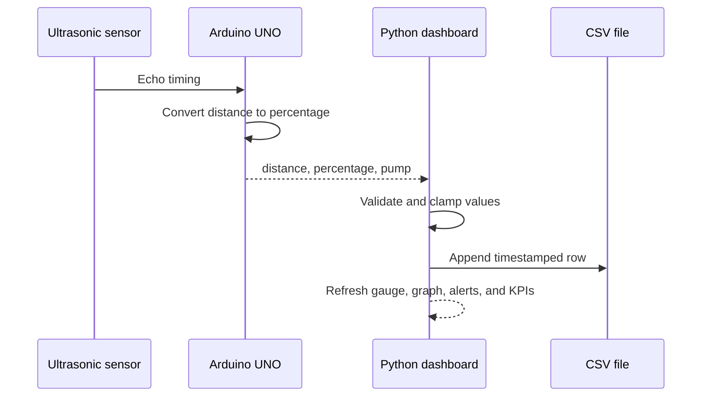
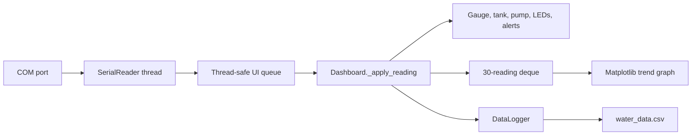

# Architecture

## System Architecture

## Hardware Block Diagram

## Software Workflow

## Data Flow Diagram

## Dashboard Communication Flow

## Design Contracts

- Serial speed: `9600` baud.
- Accepted payload: `distance_cm,water_percent,pump_state`.
- Pump state: uppercase `ON` or `OFF` after parsing.
- Percentage range: clamped to `0..100`.
- Dashboard history: maximum 30 readings in memory.
- Low threshold: below 30%.
- Full threshold: 90% or higher.
