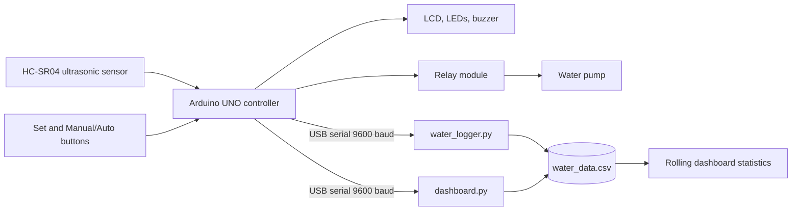

# SMART HOME WATER TANK MONITORING AND AUTOMATIC CONTROL SYSTEM WITH STATISTICAL ANALYSIS

<p align="center">
  <strong>Industrial-style monitoring, automatic pump control, and statistical visibility for a domestic water tank.</strong><br>
  Arduino UNO hardware | Python desktop dashboard | CSV-backed analysis
</p>

<p align="center">
  <a href="https://github.com/Dexter-Ron/Smart_Water_Tank/actions"></a>
  
  
  
  
  
  
</p>

> B.Tech Electrical Engineering mini project for measuring tank level, indicating operating states, controlling a relay-driven pump, and presenting logged readings for statistical analysis.

## Table of Contents

- [Project Overview](#project-overview)
- [Key Features](#key-features)
- [System Architecture](#system-architecture)
- [Hardware](#hardware)
- [Software Requirements](#software-requirements)
- [Pin Configuration](#pin-configuration)
- [Repository Structure](#repository-structure)
- [Installation](#installation)
- [Arduino Setup](#arduino-setup)
- [Python Setup](#python-setup)
- [Launch the Dashboard](#launch-the-dashboard)
- [Statistical Analysis](#statistical-analysis)
- [Testing Results](#testing-results)
- [Troubleshooting](#troubleshooting)
- [Contributors](#contributors)
- [Future Scope](#future-scope)
- [License](#license)

## Project Overview

The **SMART HOME WATER TANK MONITORING AND AUTOMATIC CONTROL SYSTEM WITH STATISTICAL ANALYSIS** combines an Arduino UNO controller with a Windows desktop dashboard. An HC-SR04 measures the distance from the sensor to the water surface. The controller translates that distance into a water percentage, drives visual and audible indicators, and reports readings over USB serial. The Python application discovers or accepts the Arduino COM port, displays live operating state, appends readings to `water_data.csv`, and keeps a rolling trend view.

The verified serial payload accepted by the dashboard is:

```text
<distance_cm>,<water_percent>,<pump_state>
```

For backward compatibility, the parser also accepts a four-field payload with a leading field. `pump_state` must be `ON` or `OFF`; water percentage is clamped to 0-100.

## Key Features

- Live water-level percentage and sensor distance.
- Automatic or manually selected control-mode indicator.
- Relay and pump status visualization.
- Red, yellow, and green operating-state indicators.
- Low-water buzzer alert below 30%.
- Full-tank state at or above 90%.
- Serial auto-discovery with manual COM-port override.
- Append-only CSV logging with timestamp, distance, percentage, and pump state.
- Rolling 30-reading trend graph, CSV export, graph export, and dashboard screenshots.
- Average, maximum, minimum, and pump activation KPIs.

## System Architecture



See [Documentation/Architecture.md](Documentation/Architecture.md) for the complete set of diagrams.

## Hardware

| Component | Purpose |
| --- | --- |
| Arduino UNO | Sensor processing, control logic, and serial interface |
| HC-SR04 | Non-contact distance measurement |
| Relay module | Electrical switching interface for the pump |
| 16x2 I2C LCD | Local level and status display |
| Active buzzer | Low-water warning |
| Red, yellow, green LEDs | Low, intermediate, and full-state indication |
| Push buttons | Setpoint and manual/automatic mode input |
| Breadboard and jumper wires | Prototyping and interconnection |

Detailed wiring, calibration, and safety guidance is in [Documentation/Hardware.md](Documentation/Hardware.md).

## Software Requirements

- Windows 10 or later.
- Python 3.13 recommended.
- Arduino IDE for firmware upload.
- VS Code recommended for Python development.
- Python packages listed in `requirements.txt`: `ttkbootstrap`, `pyserial`, `pandas`, `matplotlib`, and `Pillow`.

## Pin Configuration

| Arduino pin | Connected device | Function |
| --- | --- | --- |
| D2 | HC-SR04 Trigger | Ultrasonic trigger pulse |
| D3 | HC-SR04 Echo | Echo timing input |
| D7 | Active buzzer | Low-level warning |
| D8 | Red LED | Low water |
| D9 | Yellow LED | Intermediate level |
| D10 | Set button | Setpoint input |
| D11 | Green LED | Full/healthy level |
| D12 | Manual / Auto button | Control-mode input |
| D13 | Relay module | Pump switching output |

Power, ground, I2C LCD pins, and pump-side isolation must be wired according to the module datasheets. Do not connect mains voltage to a breadboard.

## Repository Structure

```text
.
|-- Arduino_Code/              Firmware documentation and sketch location
|-- Circuit_Diagrams/          Wiring and architecture references
|-- Documentation/             User, hardware, software, and test documentation
|-- Python_Dashboard/           Python application guide
|-- Report/                     Submission/report assets
|-- Screenshots/                Dashboard captures
|-- assets/                     Dashboard and repository media
|-- .github/                    Workflows, templates, and security policy
|-- dashboard.py                Desktop dashboard
|-- dashboard_assets.py         Dashboard drawing helpers and color system
|-- water_logger.py             Headless serial logger
|-- water_data.csv              Sample/runtime data file
|-- water_level_graph.png       Exported graph example
`-- requirements.txt            Python dependencies
```

## Installation

Clone the repository and create an isolated environment:

```powershell
git clone https://github.com/Dexter-Ron/Smart_Water_Tank.git
cd Smart_Water_Tank
py -3.13 -m venv .venv
.\.venv\Scripts\Activate.ps1
python -m pip install --upgrade pip
python -m pip install -r requirements.txt
```

For a complete setup sequence, see [Documentation/Installation.md](Documentation/Installation.md).

## Arduino Setup

The expected firmware contract and pin assignment are documented in [Documentation/Hardware.md](Documentation/Hardware.md). Open the project sketch in Arduino IDE, select **Arduino Uno**, choose the detected COM port, and upload. The firmware must emit the serial payload documented above at 9600 baud. The current workspace does not include the source sketch named in the original project brief, so the firmware source should be added under `Arduino_Code/` before publishing a hardware release.

## Python Setup

The dashboard imports `BAUD_RATE`, `CSV_PATH`, and `parse_reading` from `dashboard.py`; therefore, launch it from the repository root after installing the requirements. `water_logger.py` is a headless alternative for logging without the graphical dashboard.

## Launch the Dashboard

```powershell
python dashboard.py
```

Enter a COM port in the **PORT** field when automatic discovery cannot identify the Arduino, then select **RECONNECT**. The dashboard creates the CSV header when `water_data.csv` is missing or empty.

For headless logging:

```powershell
python water_logger.py
```

Dashboard widgets and operator workflows are described in [Documentation/Dashboard.md](Documentation/Dashboard.md).

## Statistical Analysis

The dashboard computes statistics from the in-memory rolling window of up to 30 readings and persists the raw measurements in CSV format. For level samples $L_1, L_2, ..., L_n$:

- Average: $\bar{L} = \frac{1}{n}\sum_{i=1}^{n}L_i$
- Maximum: $L_{max} = \max(L_i)$
- Minimum: $L_{min} = \min(L_i)$
- Pump activation count: number of transitions from `OFF` to `ON` observed by the dashboard.

See [Documentation/Statistical_Analysis.md](Documentation/Statistical_Analysis.md) for interpretation and limitations.

## Testing Results

The repository includes syntax validation, parser tests, documentation checks, and an engineering test matrix in [Documentation/Testing.md](Documentation/Testing.md). The sample CSV is retained as a reproducible fixture; connect real hardware before treating serial and relay results as verified in a new environment.

## Troubleshooting

Start with [Documentation/Troubleshooting.md](Documentation/Troubleshooting.md). Common checks are: confirm the Arduino appears in Device Manager, verify 9600 baud, close competing serial monitors, confirm the LCD I2C address, and test the relay with the pump power isolated.

## Contributors

| Name | Contribution |
| --- | --- |
| Rupak Chatterjee | Hardware integration, Arduino programming, Python dashboard development, testing and repository management |
| Aranyak Das | Documentation, report preparation, |

Add collaborators through **Repository Settings -> Collaborators** and grant the least privilege required for the work.

## Future Scope

Planned directions include persistent statistical reports, configurable thresholds, remote notifications, database storage, calibration profiles per tank, and an authenticated web dashboard. See [Documentation/Future_Scope.md](Documentation/Future_Scope.md).

## License

Released under the MIT License. See [LICENSE](LICENSE).
